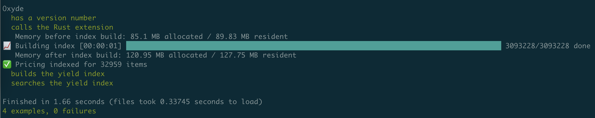
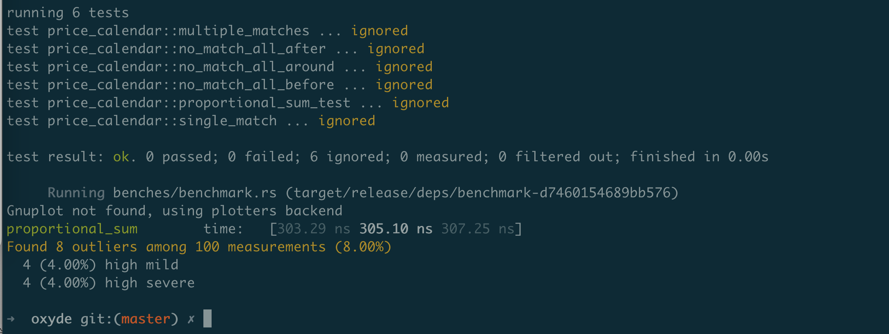
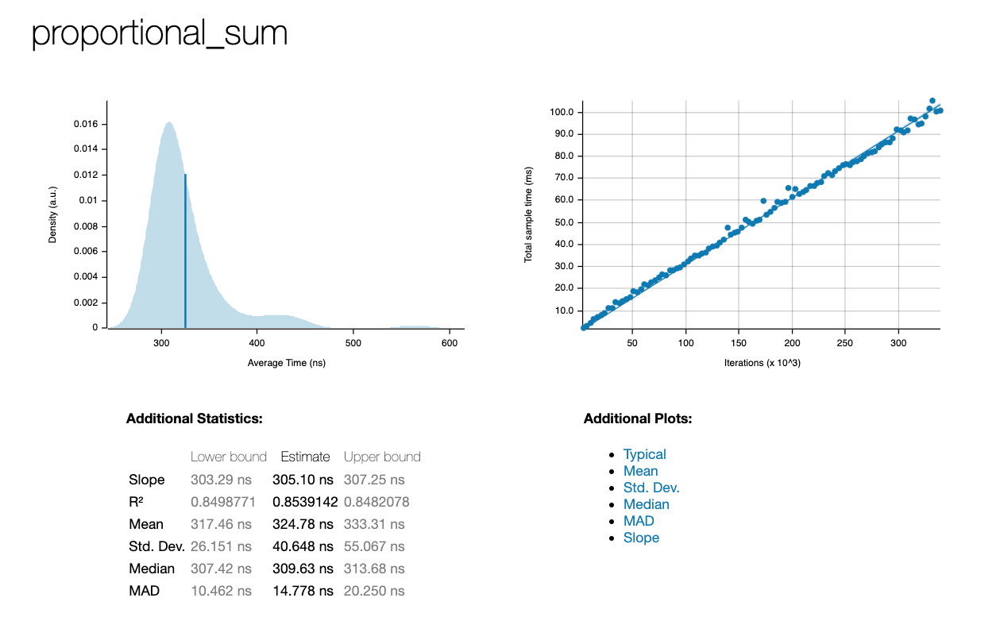

# Oxyde

Fast aggregate pricing engine in Rust.

## Installation

Install the gem and add to the application's Gemfile by executing:

    $ bundle add oxyde

If bundler is not being used to manage dependencies, install the gem by executing:

    $ gem install oxyde

## Usage

TODO: Write usage instructions here

## Development

- After checking out the repo, run `bin/setup` to install dependencies.
- Run `MYSQL_URL='...' rake spec` to run the Ruby tests.

    

- Run `cargo test` to run the Rust tests.
- You can also run `bin/console` for an interactive prompt that will allow you to experiment.

### Benchmarking

Run `cargo bench` to run preformance benchmarks.

Look at `target/criterion/proportional_sum/report` to get a report like the following:

## Resources

- https://bundler.io/blog/2023/01/31/rust-gem-skeleton.html

## Contributing

Bug reports and pull requests are welcome on GitHub at https://github.com/watsonbox/oxyde.
